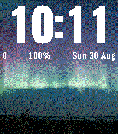
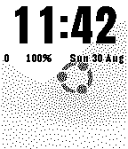

# Galleria da Polso — watchface fotografica per Pebble Time 2 e Pebble 2 Duo

> **English.** *Galleria* is a watchface for the Pebble Time 2 (`emery`, 200×228, 64 colours) and Pebble 2 Duo (`flint`, 144×168 B/W) that rotates **your own photos**, cropped on the phone, behind a big crisp clock whose colour adapts to the picture. Written in C (watch) + PebbleKit JS (phone), with a config page that crops/dithers the photos in the browser and streams them to the watch over AppMessage. This repository is the whole workspace: the app (`apps/galleria`), the tooling, the research notes and the session-by-session development plan. Everything below is in Italian.

Questo repository è l'**area di lavoro completa** dei progetti Pebble: la watchface **Galleria** (`apps/galleria`, in sviluppo, sessioni S0–S7 concluse), due app di prova usate per misurare la piattaforma (`apps/hello-emery`, `apps/heapprobe`), gli strumenti (`tools/`), la ricerca e i documenti di design (`docs/`) e il piano di sviluppo. È pensato per essere **clonato su qualsiasi computer** e ripreso da lì con Claude Code.

| emery (Pebble Time 2) | flint (Pebble 2 Duo) |
|---|---|
|  |  |

## Ripartire su un computer nuovo

Requisiti: Linux x86_64 (verificato su Ubuntu 26.04), **niente sudo** (tutto va in `$HOME`), `git`, `curl`, `gcc`, `make`, `node` ≥ 22 (test JS), `python3` con **Pillow** (strumenti e test), `apt-get`/`dpkg-deb` disponibili anche senza root (servono solo per estrarre le librerie di QEMU). Opzionali: Firefox snap + geckodriver (gate della config page nel browser), un display X/Wayland per l'emulatore (altrimenti `--vnc`).

```bash
git clone <URL di questo repo> ~/ProgettiClaude/Pebble      # il percorso canonico usato nei documenti
~/ProgettiClaude/Pebble/tools/setup-env.sh                    # idempotente: uv, Python 3.13, pebble-tool 5.0.40, SDK 4.33.1 (~780 MB), librerie QEMU, hook in ~/.bashrc
exec bash                                                     # oppure: . ~/ProgettiClaude/Pebble/tools/pebble-env.sh
pebble --version && pebble sdk list                           # atteso: Pebble Tool v5.0.40, SDK 4.33.1 attivo

cd ~/ProgettiClaude/Pebble/apps/galleria
make -C test                                                  # test host: C (gcc), node, Python (~45 s)
pebble build 2>&1 | grep -A4 "MEMORY USAGE"
pebble install --emulator emery --logs                        # watchface nell'emulatore (screenshot: pebble screenshot --emulator emery --no-open shot.png)
```

Se il clone sta in un'altra cartella funziona lo stesso (`tools/pebble-env.sh` e `tools/setup-env.sh` deducono il percorso dalla propria posizione), ma i comandi nei documenti usano `~/ProgettiClaude/Pebble`. Per la prova con SDK 4.17 (decisione D5): `pebble sdk install 4.17` (attenzione: attiva da solo l'SDK appena installato → `pebble sdk activate 4.33.1` dopo).

I due repository di riferimento in `tools/` (`sdk-docs/`, 215 MB, e `pebble-watchface-agent-skill/`) **non sono versionati**: come riclonarli è scritto in `tools/README.md` §1–2. Le foto per il gate della config page vanno in `~/galleria-gate/photos/` (fuori dal repo, vedi `apps/galleria/CLAUDE.md`).

## Come si lavora (Claude Code)

- `CLAUDE.md` (radice) — regole del progetto e di codice C; `apps/galleria/CLAUDE.md` — regole e comandi dell'app.
- `docs/CONTINUA-QUI.md` — **stato dei lavori e prossima sessione**: è il primo file da leggere.
- `apps/galleria/PIANO.md` — piano a sessioni (S0–S9), esiti, tabella memoria, decisioni, problemi aperti.
- `docs/design/galleria.md` — design (scelte D1–D16, wireframe, modello dati, protocollo, budget); `docs/design/galleria-s6-config-page.md`, `docs/design/galleria-s7-qa.md` — specifiche di sessione.
- `PIANO-SVILUPPO-PEBBLE.md` — piano generale della piattaforma (numeri, regole, matrice di QA, pubblicazione); `docs/ricerca/` — report di ricerca.
- Il lavoro è organizzato in sessioni con compiti classificati per importanza (alta → Fable, media/bassa → Opus); ogni sessione lascia il repo compilabile e aggiorna `CONTINUA-QUI.md`.

## Struttura

```
apps/galleria/        watchface Galleria: src/c (C), src/pkjs (PebbleKit JS + config page), resources/, test/ (host), store/ (asset), README.md, PIANO.md, CLAUDE.md
apps/hello-emery/     template di prova (Fase 0)
apps/heapprobe/       sonda di memoria (misure heap emery/flint, docs/fase0/)
tools/                setup-env.sh, pebble-env.sh, qemu-pebble-wrapper, photo_prep.py, gen_digits.py, build_config_page.py,
                      galleria_devserver.py, galleria_browser.py, gen_font_previews.py, svg2pdc.py, palette/ (README.md con le sezioni 1–14)
docs/                 CONTINUA-QUI.md, design/, ricerca/, fase0/
.github/workflows/    CI: build delle app con pebble-tool 5.0.40 + SDK 4.33.1 e test host di Galleria
```

## Stato e licenze

- Stato: **S7 completata** (30/08/2026). Prossima sessione **S8**: prova sull'orologio reale (iPhone e Android), decisione definitiva sull'SDK (D5), misure di batteria. Poi S9: pubblicazione negli store Core e Rebble come *Galleria for Pebble*.
- Licenza del codice: **da decidere** (TBD). Font delle cifre: SIL OFL 1.1 (`apps/galleria/resources/fonts/`). Foto demo: CC-BY-SA-4.0, solo per i test (`apps/galleria/resources/photos/README.md`), da sostituire prima della pubblicazione.
