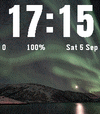
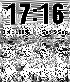

# Galleria da Polso — watchface fotografica per Pebble Time 2 e Pebble 2 Duo

> **English.** *Galleria* is a watchface for the Pebble Time 2 (`emery`, 200×228, 64 colours) and Pebble 2 Duo (`flint`, 144×168 B/W) that rotates **your own photos**, cropped on the phone, behind a big crisp clock whose colour adapts to the picture. Written in C (watch) + PebbleKit JS (phone), with a config page that crops/dithers the photos in the browser and streams them to the watch over AppMessage. This repository is the whole workspace: the app (`apps/galleria`), the tooling, the research notes and the session-by-session development plan. Everything below is in Italian.

Questo repository è l'**area di lavoro completa** dei progetti Pebble: la watchface **Galleria** (`apps/galleria`, pubblicata: **0.1.0 beta** e **0.2.0** il 05/09/2026, **0.4.0** il 18/09/2026, con la pagina delle impostazioni rifatta e lo spagnolo e il portoghese), due app di prova usate per misurare la piattaforma (`apps/hello-emery`, `apps/heapprobe`), gli strumenti (`tools/`), la ricerca e i documenti di design (`docs/`) e il piano di sviluppo. È pensato per essere **clonato su qualsiasi computer** e ripreso da lì con Claude Code.

| emery (Pebble Time 2) | flint (Pebble 2 Duo) |
|---|---|
|  |  |

## Ripartire su un computer nuovo

Requisiti: Linux x86_64 (verificato su Ubuntu 26.04), **niente sudo** (tutto va in `$HOME`), `git`, `curl`, `gcc`, `make`, `node` ≥ 22 (test JS), `python3` con **Pillow** (strumenti e test), `apt-get`/`dpkg-deb` disponibili anche senza root (servono solo per estrarre le librerie di QEMU). Opzionali: Firefox snap + geckodriver (gate della config page nel browser), un display X/Wayland per l'emulatore (altrimenti `--vnc`).

```bash
git clone <URL di questo repo> ~/ProgettiClaude/Pebble      # il percorso canonico usato nei documenti
~/ProgettiClaude/Pebble/tools/setup-env.sh                    # idempotente: uv, Python 3.13, pebble-tool 5.0.40, SDK 4.33.1 (~780 MB), librerie QEMU, hook in ~/.bashrc
exec bash                                                     # oppure: . ~/ProgettiClaude/Pebble/tools/pebble-env.sh
pebble --version && pebble sdk list                           # atteso: Pebble Tool v5.0.40, SDK 4.33.1 attivo

cd ~/ProgettiClaude/Pebble/apps/galleria
make -C test                                                  # test host: C (gcc), node, Python (~60 s)
pebble build 2>&1 | grep -A4 "MEMORY USAGE"
pebble install --emulator emery --logs                        # watchface nell'emulatore (screenshot: pebble screenshot --emulator emery --no-open shot.png)
```

Se il clone sta in un'altra cartella funziona lo stesso (`tools/pebble-env.sh` e `tools/setup-env.sh` deducono il percorso dalla propria posizione), ma i comandi nei documenti usano `~/ProgettiClaude/Pebble`. Per la prova con SDK 4.17 (decisione D5): `pebble sdk install 4.17` (attenzione: attiva da solo l'SDK appena installato → `pebble sdk activate 4.33.1` dopo).

I due repository di riferimento in `tools/` (`sdk-docs/`, 215 MB, e `pebble-watchface-agent-skill/`) **non sono versionati**: come riclonarli è scritto in `tools/README.md` §1–2. Fuori dal repo restano anche, sotto `~/galleria-gate/`, le **foto di prova** (`photos/`) e i **gate ripetibili della config page** (`ux/ux1…ux4/`: `mkstate_ux*.js`, `shots.py`, `scan_px.py`, `scan_words.py`, `cmp_preview.py`, `mkurl12.js` e gli screenshot completi di ogni giro) — su un clone pulito non ci sono, e i comandi che li nominano in `apps/galleria/CLAUDE.md` e in `docs/design/galleria-s13-ux-casual.md` vanno rieseguiti solo con quell'albero a fianco. Non sono versionati neppure i **log dell'orologio reale** e dell'emulatore (`apps/*/*.log`, `.gitignore`): i numeri che contano sono riportati nei documenti, in particolare in `docs/design/galleria-s8-risultati.md`.

## Come si lavora (Claude Code)

- `CLAUDE.md` (radice) — regole del progetto e di codice C; `apps/galleria/CLAUDE.md` — regole e comandi dell'app.
- `docs/CONTINUA-QUI.md` — **stato dei lavori e prossima sessione**: è il primo file da leggere.
- `apps/galleria/PIANO.md` — piano a sessioni (**S0–S12**, poi **UX-1…UX-4**), esiti, tabella memoria, decisioni, problemi aperti.
- `docs/design/galleria.md` — design (scelte **D1–D48**, wireframe, modello dati, protocollo, budget); le decisioni proseguono in `docs/design/galleria-s13-ux-casual.md` (**D49–D135**). Specifiche di sessione: `galleria-s6-config-page.md`, `galleria-s7-qa.md`, `galleria-s8-*.md` (hardware, runbook Android, risultati, stile), `galleria-s9-*.md` (pubblicazione, issue PebbleOS), `galleria-s10-i18n.md`, `galleria-s11-*.md` (lingue es/pt, analisi anteprima), `galleria-s12-anteprima.md`, `galleria-s13-ux-casual.md`, `galleria-s13-ux4-gate-telefono.md`, più la richiesta iniziale dell'utente in `galleria-richiesta-iniziale.txt` (tutti in `docs/design/`, indice in `docs/design/README.md`).
- `PIANO-SVILUPPO-PEBBLE.md` — piano generale della piattaforma (numeri, regole, matrice di QA, pubblicazione); `docs/ricerca/` — report di ricerca del 24–26/08/2026 (indice in `docs/ricerca/README.md`).
- Il lavoro è organizzato in sessioni con compiti classificati per importanza su **quattro livelli** (dal 05/09/2026): **alta e medio-alta → Fable**, **medio-bassa e bassa → Opus** (regola in `CLAUDE.md` di radice, §Regole operative); ogni sessione lascia il repo compilabile e aggiorna `CONTINUA-QUI.md`.

## Struttura

```
apps/galleria/        watchface Galleria: src/c (C), src/pkjs (PebbleKit JS + config page), i18n/ (135 chiavi × 6 lingue),
                      resources/ (digits, fonts, photos), test/ (host: C, node, Python), store/ (listing, icone, screenshot),
                      README.md, PIANO.md, CLAUDE.md
apps/hello-emery/     smoke test dell'ambiente (Fase 0), compilato anche dalla CI
apps/heapprobe/       sonda di memoria (misure heap emery/flint, log in docs/fase0/)
tools/                README.md (19 sezioni numerate: una per strumento o gruppo di strumenti)
                      ambiente:  setup-env.sh, pebble-env.sh, qemu-pebble-wrapper, setup-adb.sh
                      Galleria:  photo_prep.py, gen_digits.py, build_config_page.py, build_i18n.py, galleria_devserver.py,
                                 galleria_browser.py, galleria_gloss_check.py, galleria_logstats.py, gen_test_cards.py,
                                 gen_font_previews.py (fuori dalla build dal 13/09/2026, tenuto come strumento)
                      icone e colore: svg2pdc.py, pebble_image_routines.py, palette/, test/ (icon.svg → icon.pdc),
                                 upstream-py2/ (originali Python 2 di Pebble, non modificati)
docs/                 CONTINUA-QUI.md   stato dei lavori e prossimo passo
                      design/           README.md (indice), galleria.md, galleria-s6…s13-*.md, galleria-richiesta-iniziale.txt,
                                        galleria/ (171 screenshot dei gate e dello store, 5,4 MiB, con il proprio README delle licenze)
                      ricerca/          README.md (indice), 12 report + verifica-risultati.json, galleria/ (7 approfondimenti)
                      fase0/            log e screenshot delle misure del 24/08/2026 (heap, emulatori)
.github/workflows/    CI: build delle 3 app con pebble-tool 5.0.40 + SDK 4.33.1 e test host di Galleria
```

## Stato e licenze

- Stato: **pubblicata** — nello store Core dal 05/09/2026: https://apps.rePebble.com/cdf80cc3bf6745b1a310e4c8 (autore Rediro; **0.1.0 beta**, tag git `v0.1.0-beta`, e **0.2.0** multilingua, tag `v0.2.0`, lo stesso giorno). **0.4.0 pubblicata il 18/09/2026** (tag git `v0.4.0`; nello store l'app si chiama **«Galleria»**, rinominata dall'utente dalla dashboard, verificato il 19/09/2026): **pagina delle impostazioni rifatta** (aggiungi foto in cima, anteprima della watchface con la tua foto e l'ora, «Altre impostazioni» ripiegate) **e spagnolo e portoghese** (pagina e data dell'orologio in sei lingue). (La **0.3.0** non è mai stata pubblicata: le sue novità sono uscite con la 0.4.0 e delle sue release notes resta solo il testo in `apps/galleria/store/LISTING.md` §3.1.) Resta da mandare allo store la **descrizione nuova** (il `PATCH` di `apps/galleria/store/PUBLISH.md` §0.1: online c'è ancora quella della 0.2.0). Restano i passi sull'hardware (batteria 48 h, Pebble 2 Duo reale, iPhone oltre al primo giro del 06/09) e le migliorie in `apps/galleria/PIANO.md` §7/§8.
- Licenza del codice: **MIT** — testo in [`LICENSE`](LICENSE) («Copyright (c) 2026 Rediro»); autore **Rediro**. Font delle cifre: SIL OFL 1.1 (`apps/galleria/resources/fonts/`). Foto demo: **CC0 1.0** da Wikimedia Commons, senza obbligo di attribuzione (`apps/galleria/resources/photos/README.md`).
- Materiale di terzi ridistribuito nel repository (codice Pebble MIT, palette Apache-2.0, font OFL, foto CC0, screenshot storici CC-BY-SA-4.0): [`THIRD-PARTY-NOTICES.md`](THIRD-PARTY-NOTICES.md).
