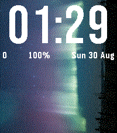
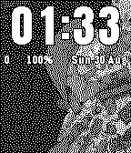

# Galleria — watchface con le tue foto per Pebble Time 2

Watchface per **Pebble Time 2** (`emery`, 200×228, 64 colori) e **Pebble 2 Duo** (`flint`, 144×168 B/N)
che mostra a schermo intero, **a rotazione**, le foto che scegli e ritagli **dal telefono**, con l'ora
grande e nitida sopra e il **colore del testo scelto da solo** (bianco o nero, in base alla foto).

| emery (Pebble Time 2) | flint (Pebble 2 Duo) |
|---|---|
|  |  |

Screenshot dal gate di S6 (30/08/2026); tutti gli altri sono in `../../docs/design/galleria/`.

## Requisiti

- **Orologio**: Pebble Time 2 (`emery`) oppure Pebble 2 Duo (`flint`). Nessun'altra piattaforma è
  compilata (`targetPlatforms` in `package.json`).
- **Firmware minimo**: dipende dall'SDK con cui si compila. Con l'SDK **4.33.1** di oggi il `.pbw`
  gira solo su **PebbleOS ≥ 4.32.0**; compilando con SDK 4.17 basta fw ≥ 4.17.0
  (`../../PIANO-SVILUPPO-PEBBLE.md` §2.4). Il minimo **non è dichiarabile** in `package.json`: è
  l'orologio che rifiuta l'app con il popup «Incompatible SDK». Decisione **D5**: in S7 la build con
  SDK 4.17 è risultata identica (memoria, log, emulatori 4.17 e 4.33.2), ma in campo PebbleOS
  **4.32.0 è uscito il 29/07/2026** e **4.36.2 il 26/08/2026**, spinti dall'app al primo
  abbinamento; la proposta aggiornata è quindi pubblicare con **SDK 4.33.1**, e si torna a 4.17 solo
  se l'orologio dell'utente resta sotto 4.32. Conferma in S8 sull'orologio reale (`PIANO.md` §3 D5,
  `../../docs/design/galleria-s8-hardware.md` §6).
- **Telefono**, solo per caricare le foto: app Pebble per **Android ≥ 1.8.0.7** (04/08/2026), la
  prima che apre il selettore di file nella pagina di configurazione. Per lo sviluppo serve anche
  **≥ 1.10.0**, la prima con il receiver che il trasporto `--adb` del `pebble` CLI usa per aprire
  la Dev Connection senza toccare la UI (prima di quella versione resta `--phone <IP>`). Su **iOS**
  il selettore lo gestisce WebKit ma **non è mai stato provato** (`PIANO.md` §7).
- Senza telefono l'app funziona lo stesso: foto e impostazioni stanno nella memoria dell'orologio.

## Come si usa

### Caricare le foto (config page)

Dall'app Pebble: elenco orologi → Galleria → ⚙ **Impostazioni**. Si apre la pagina di
configurazione, una colonna sola, dove:

1. **Aggiungi foto** apre il selettore di file del telefono.
2. Nell'**editor** la cornice è fissa nel rapporto dello schermo (200:228; con un Pebble 2 Duo si
   vede tratteggiato anche il sotto-rettangolo 144:168): sposti e ingrandisci la foto sotto la
   cornice (trascinamento, pinch, rotellina, slider, «Adatta»). Puoi regolare **Luminosità (gamma)**
   e **Schiarisci le ombre**, scegliere il **dithering** (Floyd–Steinberg, Bayer/Atkinson, nessuno)
   e attivare **«Ottimizza per il vetro»** (di default spento: va confermato sul pannello vero,
   decisione D6). L'**anteprima ×2** mostra la foto «come sul vetro» oppure a colori nominali.
3. Le tessere sono in **ordine di rotazione**: ▲ ▼ per riordinare, ✕ per eliminare; un badge dice se
   una foto è *da inviare*, *nuova* o *solo sull'orologio*.
4. Sotto ci sono tutte le **impostazioni**: layout A o B, font, **stile delle cifre**, 12/24 h, zero
   iniziale, colore del testo, contorno, intervallo di rotazione, ordine, «scuoti per la prossima»,
   voci della riga info.
5. **Salva** manda tutto all'orologio. Un contatore mostra quanti KB stai per inviare: oltre il tetto
   del telefono il pulsante si disabilita e ti dice quante foto togliere.

Il trasferimento è a chunk: durante la sync la riga info scrive «Foto k/n». Puoi uscire dalla pagina,
riprende da solo.

In cima alla pagina compare un **avviso** se l'orologio ha impiegato più di un secondo ad avviarsi
(l'orologio dichiara il tempo di apertura della sua memoria dentro il messaggio di saluto), e in
fondo c'è **sempre** la sezione ripiegabile **«Galleria si avvia lentamente?»** con la spiegazione e
la procedura: sono le stesse due cose che trovi qui sotto.

### Sull'orologio

- **Layout A** (default): cifre da 68 px su circa un terzo dello schermo, più una riga con passi,
  batteria e data (icona Bluetooth barrata al posto dei passi se il telefono non è connesso).
- **Layout B**: solo l'ora, HH sopra MM, cifre da 96 px a tutto schermo.
- **Font**: Anton (default), Bebas Neue, Barlow Condensed Bold, Francois One, Staatliches e — solo
  nel layout A — il LECO 60 di sistema.
- **Stile delle cifre**: *pieno* (come sempre), *trasparente* (dentro le cifre si vede la foto, con
  un contorno spesso), *trasparente 3D* e *pieno 3D* (con un'ombra sfalsata in basso a destra). Su
  **Pebble 2 Duo** lo schermo è in bianco e nero e l'ombra 3D non è disponibile: i due stili 3D
  valgono come i corrispondenti piatti. Con il font LECO lo stile non si applica (resta pieno).
- **Rotazione**: la foto cambia da sola a intervalli (5, 15, 30, 60, 180 minuti o una volta al
  giorno; default 30 min), in ordine sequenziale o casuale. Il calcolo dipende solo dall'ora, quindi
  a regime **non scrive nulla** in memoria.
- **Scossa**: una scossa passa alla foto successiva (si può disattivare). La foto non cambia mentre
  l'orologio non è in primo piano né durante una sincronizzazione. Il salto **non viene conservato**:
  vale fino al riavvio della watchface (quando esci e rientri, o riavvii l'orologio), poi la
  rotazione riprende dal suo programma, che dipende solo dall'ora. È voluto: scrivere in memoria a
  ogni scossa — ne bastano un centinaio al giorno di involontarie — è ciò che con il tempo rendeva
  lento l'avvio (vedi sotto).
- **Colore del testo**: calcolato sull'orologio a ogni cambio foto sulla fascia occupata dalle cifre;
  bianco o nero, con contorno automatico quando la foto è troppo mossa di luminanza. Si può anche
  forzare (bianco, nero, giallo pastello, blu Oxford).
- Aggiornamento al **minuto**, mai i secondi, nessuna animazione, nessun timer continuo.
- Con l'album vuoto partono le **2 foto demo** incluse nell'app.

### Galleria si avvia lentamente?

Se passando ad un'altra app e tornando indietro Galleria ci mette **qualche secondo** a comparire,
non è un guasto: **la memoria dell'orologio si è riempita di vecchi dati**. Ogni volta che una foto
viene sostituita, il vecchio contenuto resta nel file come spazio morto — l'orologio non lo libera
mai da solo (lo ricompatta solo quando il file è quasi pieno) — e l'orologio deve scorrerlo tutto
ogni volta che apre l'app.

**La cura è svuotare quel file, e si fa dal telefono:**

1. apri l'**app Pebble**;
2. tocca **Galleria** nell'elenco delle app dell'orologio;
3. scegli **Rimuovi** (⚠️ *non* «Aggiorna»: un aggiornamento conserva la memoria dell'app, una
   rimozione la cancella);
4. **reinstalla** Galleria.

**Le tue foto sono al sicuro nel telefono**: dopo la reinstallazione tornano da sole sull'orologio in
circa un minuto, insieme alle impostazioni.

Con questa versione capita **molto più di rado**: l'app non scrive più nulla né a ogni scossa né a
ogni collegamento col telefono. Numeri misurati su un Pebble Time 2: avvio **~0,3 s** con un file
sano contro **~2,7 s** con un file gonfio; dopo la reinstallazione l'avvio è tornato a 0,31–0,36 s
(`PIANO.md` §4, esito S8-perf).

## Limiti noti

- **12 foto** al massimo (12 slot in memoria persistente, decisione D8).
- **Un solo formato per orologio**: `raw6` per emery, `raw1` per flint. La pagina invia solo il
  formato dell'orologio collegato: una foto caricata da un Pebble Time 2 non è pronta per un Pebble
  2 Duo (la tessera lo segnala con «manca il formato per questo orologio»).
- **iOS mai provato** (né il selettore di file né il limite dell'URL di ritorno): il percorso certo
  oggi è Android. Vedi `PIANO.md` §7.
- **La memoria dell'app non si rimpicciolisce mai da sola**: eliminare o sostituire foto non libera
  spazio nel file dell'orologio (il firmware lo ricompatta solo quando è quasi pieno). Se l'avvio
  diventa lento, la cura è rimuovere e reinstallare l'app: vedi «Galleria si avvia lentamente?».
- Il salto di foto con la **scossa** non sopravvive al riavvio della watchface (scelta voluta: vedi
  «Sull'orologio»).
- Niente PNG sull'orologio in v1; il layout B non ha la riga info.
- I passi della riga info si aggiornano al **tick del minuto** (mai i secondi): un cambiamento appare entro un minuto.
- Le foto demo attuali sono wallpaper CC-BY-SA-4.0: **solo per i test**, vanno sostituite prima di
  pubblicare (`resources/photos/README.md`).

## Struttura del progetto

```
src/c/         main.c, ui_time.c, ui_photo.c, ui_digits.c, model.c, storage.c, sync.c, settings.c
               logica pura senza pebble.h (testabile su host): timefmt.c, luma.c, crc.c,
               photo_codec.c, rotation.c, sync_proto.c + gal_types.h, settings.h, digit_metrics.h
src/pkjs/      index.js (eventi Pebble, modalità dev, retry), album.js (album in localStorage e
               diff), sync.js (motore), devserver.js, crc.js, b64.js, config_page.js (generato)
src/pkjs/config/  sorgenti ES5 della config page: page.html, page.css, page_core.js, page.js,
               pipeline.js (porting byte-esatto di tools/photo_prep.py), previews.js
resources/     photos/ (2 demo raw6+raw1), digits/ (strip PNG delle cifre), fonts/ (TTF sorgente,
               NON entrano nel .pbw)
test/          test host in C (gcc) + test node + selftest Python
../../tools/   photo_prep.py (foto → raw6/raw1), gen_digits.py (TTF → strip + digit_metrics.h),
               gen_font_previews.py, build_config_page.py (inlina la config page),
               galleria_devserver.py (config page dell'emulatore), galleria_browser.py
```

Documenti: `PIANO.md` (piano a sessioni, memoria in §5, problemi aperti in §7),
`../../docs/design/galleria.md` (design), `../../docs/design/galleria-s6-config-page.md`
(config page), `CLAUDE.md` (regole di lavoro sull'app).

## Build, test, emulatore

```bash
. ~/ProgettiClaude/Pebble/tools/pebble-env.sh
cd ~/ProgettiClaude/Pebble/apps/galleria

make -C test pagecheck        # config page inlinata aggiornata: PRIMA di ogni build
pebble build 2>&1 | grep -A4 "MEMORY USAGE"

pebble install --emulator emery --logs
pebble screenshot --emulator emery --no-open shot_emery.png
pebble install --emulator flint && pebble screenshot --emulator flint --no-open shot_flint.png

make -C test                  # tutti i test host: C (gcc), node, selftest Python

# config page in emulatore (dev server al posto della pagina data:)
python3 ../../tools/galleria_devserver.py --page-dir src/pkjs/config
BROWSER=true pebble emu-app-config --emulator emery &
python3 ../../tools/galleria_browser.py open-emu     # Firefox headless via geckodriver

# preparare una foto a mano, senza telefono
python3 ../../tools/photo_prep.py --out resources/photos --name demo_1 --stats foto.jpg
```

### Sull'orologio reale (S8)

Serve il telefono: l'orologio parla con il PC **attraverso l'app Pebble**. Nell'app: scheda
dell'orologio → ⋯ → **Dev Connection**, e Settings → Connectivity → **Use LAN developer
connection** (mostra l'IPv4 del telefono). Poi, con `IP` = quell'indirizzo:

```bash
pebble ping --phone IP                              # "Pong!" = collegamento ok
pebble ping --phone IP -vvv 2>&1 | grep -i watchversion   # firmware e modello dell'orologio
pebble install build_s8/galleria_p.pbw --phone IP --logs  # installa e resta attaccato ai log (il .pbw PRIMA delle opzioni: con --adb un percorso dopo il flag diventerebbe il seriale)
pebble logs --phone IP                              # solo i log (Ctrl-C per chiudere)
pebble screenshot --phone IP --no-open shot.png     # dal vetro; --no-correction = colori nominali
```

- **Alternative al trasporto**: `--adb` (app Android ≥ 1.10.0: forza la LAN da solo e dà anche
  `adb logcat`; `tools/setup-adb.sh` e `tools/README.md` §15) e `--cloudpebble` (richiede
  `pebble login`). ⚠️ `--phone` **senza IP** significa CloudPebble, non «il telefono».
- **Chiudere i log senza perderli**: `timeout -s INT 600 pebble logs --phone IP > run_s8_x.log 2>&1`
  — con SIGTERM il gestore di Ctrl-C del tool non gira e il log shipping resta acceso sull'orologio
  (saltano anche gli `atexit`, come la rimozione dell'`adb forward`);
  `timeout` esce 124 anche quando ha interrotto pulito.
- Nessun comando `emu-*` funziona sull'orologio reale (sono dell'emulatore), né `pebble insert-pin`.
- Riepilogo dei log e test card del gate:

```bash
python3 ../../tools/galleria_logstats.py run_s8_*.log --md   # 13 sezioni (tools/README.md §16)
python3 ../../tools/gen_test_cards.py --check                # 18 card in ~/galleria-gate/cards (§17)
```

Procedura passo passo, con cosa fa Marco e cosa aspettarsi a ogni passo:
`../../docs/design/galleria-s8-runbook-android.md`.

Hook di debug (`GALLERIA_DEFINES="..." pebble build`), rigenerazione delle cifre e comandi completi:
`CLAUDE.md` di questa cartella.

**Memoria e tempi**: la tabella per sessione è in `PIANO.md` §5 e il budget in
`../../docs/design/galleria.md` §8 — sono l'unica fonte dei numeri, qui non se ne riportano copie
che invecchiano.

## Licenze

- **Codice dell'app**: **TBD** — da decidere con l'autore prima della pubblicazione (S9).
- **Font delle cifre**: Anton, Bebas Neue, Barlow Condensed Bold, Francois One e Staatliches, tutti
  **SIL Open Font License 1.1** (testo integrale e provenienza in `resources/fonts/`). I TTF non
  entrano nel `.pbw`: dell'app fanno parte solo le immagini delle cifre. Credito facoltativo per lo
  store: «Cifre: Anton, Bebas Neue, Barlow Condensed, Francois One, Staatliches (SIL OFL 1.1)».
- **Foto demo**: wallpaper di Ubuntu, **CC-BY-SA-4.0** (dettagli e autori in
  `resources/photos/README.md`). Sono lì **solo per i test locali** e vanno sostituite con foto
  proprie o CC0 prima di pubblicare.
- SDK e strumenti Pebble: PebbleOS Apache-2.0, pebble-tool MIT, SDK con EULA proprietaria
  (`../../PIANO-SVILUPPO-PEBBLE.md` §13).

## Bozza della descrizione per lo store (S9)

> **Galleria for Pebble**
>
> Your own photos, full screen, behind a big clean clock. Pick pictures on your phone, crop them in
> the settings page, and Galleria stores them on the watch: they rotate on their own — every 5
> minutes to once a day — and a shake jumps to the next one. The time is drawn with crisp bitmap
> digits in your choice of font, in a one-third layout with steps, battery and date, or full screen;
> the text turns white or black by itself depending on the photo behind it. It updates once a minute,
> never shows seconds and never animates, and it keeps working with the phone away — photos and
> settings live on the watch.
>
> Up to 12 photos. Requires Pebble Time 2 or Pebble 2 Duo with firmware 4.32 or newer (built with
> SDK 4.33.1). To load photos, open the Pebble app, tap Galleria, open its settings, then "Aggiungi
> foto", crop, and Save — the watch shows "Foto k/n" while they transfer.
>
> Digits: Anton, Bebas Neue, Barlow Condensed, Francois One, Staatliches (SIL OFL 1.1).

*(Da rivedere in S9 insieme al firmware minimo definitivo — decisione D5 — e alle foto demo
sostitutive; lo store non è localizzato, quindi la descrizione resta in un testo unico.)*
