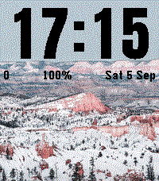

# Galleria — watchface con le tue foto per Pebble Time 2

Watchface per **Pebble Time 2** (`emery`, 200×228, 64 colori) e **Pebble 2 Duo** (`flint`, 144×168 B/N)
che mostra a schermo intero, **a rotazione**, le foto che scegli e ritagli **dal telefono**, con l'ora
grande e nitida — **in alto, in basso** oppure a tutto schermo — e il **colore del testo scelto da
solo** (bianco o nero, in base alla foto).

|  |  |
|---|---|
| <br>**emery** — «Ora in alto», Anton, foto di esempio scura → testo bianco | <br>**flint** — «Ora in alto», Anton, foto di esempio chiara → testo nero |
| <br>**emery** — «Ora in alto», Anton, foto di esempio chiara → testo nero | <br>**emery** — «Ora grande», Francois One, stile «contorno con ombra» |

Screenshot dal gate **S9-prep** (05/09/2026), con le due foto di esempio CC0 e nessuna foto tua;
tutti gli altri sono in `../../docs/design/galleria/`. La **pagina delle impostazioni di oggi** è
quella del gate **S14** del **19/09/2026** (qui sotto); del gate del **14/09/2026** resta la pagina
com'era prima di quelle novità: `s13_ux4_page_it_editor_400.png` («Ritaglio» aperto, con la
cornice e l'anteprima dell'orologio sotto) e `s13_ux4_page_it_adv_400.png` («Altre impostazioni»
aperte). Dal gate della notte prima restano la pagina intera (`s13_ux3_page_it_400.png`), la tessera
appena aggiunta (`s13_ux3_page_it_after_add_400.png`), la ✕ al primo tocco
(`s13_ux3_page_it_del_arm_400.png`), la pagina in tedesco su uno schermo stretto
(`s13_ux3_page_de_editor_360.png`) e l'anteprima confrontata al pixel con l'emulatore
(`s13_ux3_preview_editor_dark_b.png`).

Dal gate **S14** (19/09/2026 sera) c'è il set della disposizione nuova, **«Ora in basso»**:
`s14_emery_l2_24h.png` (Anton, 24 h), `s14_emery_l2_12h.png` («PM» accanto alle cifre),
`s14_emery_l2_qv.png` (con la Quick View il blocco sale), `s14_emery_l2_xl.png` (testo
ingrandito), `s14_emery_l2_leco.png` (Font di sistema), `s14_emery_l2_francois_t3d.png`
(Francois One, «contorno con ombra»), `s14_emery_l2_sync.png` (sincronizzazione in corso),
`s14_flint_l2_24h.png` e `s14_flint_l2_qv.png` sul Pebble 2 Duo. Della pagina (in inglese):
`s14_page400_settings.png` e `s14_page360_settings.png` («Aspetto dell'ora» a 400 e a 360 px, con
le tre disposizioni e il Font senza frecce), `s14_page400_editor_adv.png` («Regolazioni della
foto» con «Ottimizza» spuntata di serie) e `s14_page400_prev.png` (l'anteprima con l'ora in
basso).

Restano nella stessa cartella, come **storia** delle versioni precedenti: la pagina prima del
rifacimento (`s10_page_*.png`, `s11_page_es_settings.png`, `s11_page_pt_settings.png`,
`s12_page_prev_*.png`, `s12_page_tiles_eye.png`), la data sull'orologio con la lingua forzata
(`s10_emery_a_lang_*.png`, `s10_flint_a_lang_de.png` / `…_fr`, `s11_emery_a_es.png` con «do 6 sep»,
`s11_emery_a_pt.png` con «Dom 6 de Set», `s11_flint_a_pt.png`, e la lingua automatica in
`s11_emery_a_auto_en.png`, «Sun 6 Sep» con i passi «6,532») e l'icona di sincronizzazione con «k/n»
(`s10_emery_a_sync.png`, `s10_emery_b_sync.png`, `s10_flint_a_sync.png`).

## Requisiti

- **Orologio**: Pebble Time 2 (`emery`) oppure Pebble 2 Duo (`flint`). Nessun'altra piattaforma è
  compilata (`targetPlatforms` in `package.json`).
- **Firmware minimo**: dipende dall'SDK con cui si compila. Con l'SDK **4.33.1** di oggi il `.pbw`
  gira solo su **PebbleOS ≥ 4.32.0**; compilando con SDK 4.17 basta fw ≥ 4.17.0
  (`../../PIANO-SVILUPPO-PEBBLE.md` §2.4). Il minimo **non è dichiarabile** in `package.json`: è
  l'orologio che rifiuta l'app con il popup «Incompatible SDK». Decisione **D5**: in S7 la build con
  SDK 4.17 è risultata identica (memoria, log, emulatori 4.17 e 4.33.2), ma in campo PebbleOS
  **4.32.0 è uscito il 29/07/2026** e **4.36.2 il 26/08/2026**, spinti dall'app al primo
  abbinamento. **D5 è chiusa dal 05/09/2026** (risposta U5 dell'utente: «l'ultimo SDK, 4.33.1»):
  tutte le release, dalla 0.1.0 beta alla **1.0.0**, sono compilate con **SDK 4.33.1** (fw ≥ 4.32)
  e la build di prova con 4.17 resta solo di riferimento (`PIANO.md` §3 D5,
  `../../docs/design/galleria.md` §2 D5).
- **Telefono**, solo per caricare le foto: app Pebble per **Android ≥ 1.8.0.7** (04/08/2026), la
  prima che apre il selettore di file nella pagina di configurazione. Per lo sviluppo serve anche
  **≥ 1.10.0**, la prima con il receiver che il trasporto `--adb` del `pebble` CLI usa per aprire
  la Dev Connection senza toccare la UI (prima di quella versione resta `--phone <IP>`). Su **iOS**
  il selettore lo gestisce WebKit: **provato il 06/09/2026** (caricamento e sincronizzazione di una
  foto riusciti), ma il giro completo non è finito (`PIANO.md` §7,
  `../../docs/design/galleria-s8-risultati.md` §S8b).
- Senza telefono l'app funziona lo stesso: foto e impostazioni stanno nella memoria dell'orologio.

## Come si usa

### Caricare le foto (la pagina delle impostazioni)

Dall'app Pebble: l'orologio → **elenco delle app** → Galleria → ⚙ **Impostazioni**. Si apre una
pagina in una colonna sola, intitolata **«Galleria»**, con sotto l'orologio collegato («Pebble
Time 2», «Pebble 2 Duo · bianco e nero», oppure «Orologio non collegato: foto a colori»).
Nell'ordine in cui la scorri:

1. **Le tue foto** comincia con **Aggiungi foto**, in blu, che apre il selettore di file del
   telefono («scegli una foto dal telefono»). Mentre la foto si apre dice **«Un momento…»**;
   diventa grigio e spiega perché quando le foto sono già 12, oppure quando un'altra foto non
   entrerebbe nello stesso invio («Salva queste foto, poi riapri le impostazioni per aggiungerne
   altre»). Sotto il pulsante una riga conta le foto («3 di 12 foto»); finché non ne hai nessuna
   spiega quelle che vedi al polso e quante puoi metterne: «Senza foto tue, l'orologio mostra 2
   foto di esempio: spariscono quando arriva la tua prima foto. Ne puoi mettere fino a 12.»
2. Le tessere delle foto sono nell'**ordine delle foto** (con «Ordine: come l'elenco» è anche
   l'ordine in cui girano sull'orologio): ▲ ▼ per riordinare, ✕ per togliere. La **✕ chiede conferma
   con se stessa**: il primo tocco la fa diventare rossa e la riga in basso dice «Tocca di nuovo ✕
   per togliere *nome*», il secondo la toglie davvero (e qualunque altra cosa tu faccia nel
   frattempo la disarma: niente finestre di conferma e niente tempo che scade). La pagina risponde
   «Foto tolta: sparirà dall'orologio quando salvi»: dall'orologio la foto se ne va **al Salva**,
   come le aggiunte. Un badge dice se una foto è *da salvare*, *non è ancora sull'orologio*, *solo
   sull'orologio* o *da togliere e riaggiungere*; quelle *solo sull'orologio* non si spostano. La
   riga «Questo è l'ordine delle foto: ▲ ▼ per cambiarlo» compare quando c'è davvero da riordinare:
   almeno due foto spostabili, ordine «come l'elenco» e un cambio foto attivo. Subito sotto, nella
   stessa sezione, c'è **«Cambio foto»**: ogni quanto cambia, in che ordine e ☑ «Scuoti il polso per
   cambiare foto» (dal 13/09/2026 stanno qui, non più in mezzo alle impostazioni dell'ora: parlano
   delle foto).
3. Scelta una foto si apre **«Ritaglio»**, subito sotto «Le tue foto»: in cima c'è il **nome del
   file** (le dimensioni in pixel restano nel suggerimento). La cornice è fissa nel rapporto dello
   schermo del **Pebble Time 2** (200:228); con un **Pebble 2 Duo** il rettangolo tratteggiato
   144:168 dentro la cornice è **la parte che finisce sull'orologio** (il resto è velato). La
   cornice lascia una **corsia libera per lato**, così il pollice può scorrere la pagina senza
   trascinare la foto: sposti e ingrandisci la foto sotto la cornice (trascinamento, pinch,
   rotellina, slider, «Riparti da capo»). Sotto la cornice c'è l'**anteprima dell'orologio** (dal
   13/09/2026): la foto con i pixel veri e l'ora campione **12:34** nel font, stile, colore e
   contorno che hai scelto — «Così si vede sull'orologio» —, grande quanto lo schermo
   dell'orologio. Quello che si tocca di rado sta nel blocco **«Regolazioni della foto»**, chiuso:
   **Luminosità**, **Schiarisci le ombre**, **Sfumature** (Floyd–Steinberg; «Bayer 4×4» con le foto
   a colori oppure «Atkinson» sul Pebble 2 Duo; nessuna) e, **solo quando le foto vanno a colori**
   (Pebble Time 2, oppure nessun orologio collegato), **«Ottimizza per lo schermo dell'orologio»**
   e **«Colori»** («come sull'orologio» oppure «senza correzione»). Dal **19/09/2026 «Ottimizza» è
   spuntata di serie** (prima era spenta): vale per le **foto nuove**, quelle già sull'orologio non
   cambiano (vedi «Dettagli tecnici»). Se uno di quei valori non è più quello di fabbrica il blocco
   si apre da solo — quindi ora si apre quando «Ottimizza» è **spenta**. Intanto i due pulsanti in
   fondo alla pagina diventano **«Usa questa foto»** e **«Non aggiungere»**: con **«Usa questa
   foto»** il ritaglio si chiude, la pagina scorre da sola alla **tessera nuova** (badge «da
   salvare») e in fondo compare in verde **«Foto aggiunta: tocca Salva per inviarla
   all'orologio»**, con sotto la riga grigia «Dopo Salva, le foto passano all'orologio una alla
   volta: tieni aperta l'app Pebble»; **«Non aggiungere»** chiude il ritaglio dicendo «Foto non
   aggiunta» e ti riporta su «Aggiungi foto».
4. Poi vengono le **Impostazioni**. In **«Aspetto dell'ora»**: **Disposizione** — dal 19/09/2026
   **tre voci**, in quest'ordine: «Ora in alto, info sotto», **«Ora in basso, info sopra»** e «Ora
   grande, senza info» —, **font** (una sola tendina: le frecce **‹ ›** per sfogliarli non ci sono
   più, e l'anteprima si aggiorna a ogni scelta), **«Stile cifre»** e **«Colore dell'ora»**.
   Scegliendo **«solo contorno»** o **«contorno con ombra»** con uno dei tre font stretti (Anton,
   Bebas Neue, Barlow Condensed) la pagina consiglia i due che rendono meglio, Francois One e
   Staatliches — e l'aiuto sparisce appena li scegli; con un **Pebble 2 Duo** collegato e «solo
   contorno» avvisa anche che lì il contorno delle cifre è **sottile**, e che con foto molto
   dettagliate conviene lo stile pieno.
5. Subito sotto «Colore dell'ora», ultima voce di «Aspetto dell'ora», c'è l'**«Anteprima»** (dal
   06/09/2026): la foto con i **pixel veri** — quella scelta con l'**occhio** 👁︎ in basso a sinistra
   della miniatura; mentre «Ritaglio» è aperto questa sezione sparisce, perché l'anteprima si vede
   sotto la cornice — con l'ora campione **12:34** nel font, stile, disposizione, colore e contorno
   che hai scelto, posizionata con la stessa griglia dell'orologio e con il colore automatico
   calcolato come sul polso. La didascalia nomina la foto («*nome*: così si vede con l'ora (12:34
   è solo un esempio)») e la riga sotto dice la decisione presa quando colore e bordo sono su
   «automatico» («Colore automatico: bianco · bordo di contrasto: no»; se ne hai fissato uno a
   mano resta la sola mezza riga di quello automatico, «Colore dell'ora: bianco» oppure «Bordo di
   contrasto: no»). È un'anteprima **onesta**, non un finto orologio:
   - l'occhio c'è **solo sulle foto aggiunte in questa sessione** (delle foto già sull'orologio la
     pagina ha soltanto la miniatura, non i pixel) e **solo se sono almeno due**, cioè quando c'è
     davvero da scegliere; con una foto nuova sola l'anteprima la mostra lo stesso. La scelta non
     si ricorda alla riapertura;
   - senza nessuna foto nuova resta uno **sfondo grigio** con le cifre bianche e la didascalia
     «Aggiungi una foto e la vedrai qui con l'ora» (se qualche foto è già sull'orologio: «…: quelle
     già presenti no»);
   - **non** si vedono la riga delle info, «PM», Quick View e testo ingrandito, e la nota lo dice
     **solo quando quella cosa sull'orologio c'è davvero**: «Con le 12 h sull'orologio compare anche
     PM» con il formato 12 ore, «Sull'orologio, **sopra o sotto** l'ora, compare quello che hai
     scelto: passi, batteria, data» con «Ora in alto» **o «Ora in basso»** e le sole caselle che hai
     acceso (se le hai tolte tutte, o con «Ora grande», la nota non compare); di Quick View e testo
     ingrandito la pagina non dice più niente;
   - con il **Font di sistema** e una delle due disposizioni con l'ora piccola («Ora in alto» o «Ora
     in basso») si vede la sola foto: «Font di sistema: qui non si vedono, sull'orologio sì» (con
     «Ora grande» l'anteprima disegna Anton, come fa l'orologio);
   - se qualcosa va storto la sezione dice «Anteprima non disponibile» e il resto della pagina
     continua a funzionare.

   Dal 13/09/2026 l'anteprima si vede a **grandezza naturale**: 200 px di larghezza su Pebble
   Time 2, 144 su Pebble 2 Duo, cioè esattamente quanto misura lo schermo dell'orologio (il disegno
   interno è al doppio della risoluzione, così resta nitido anche sui telefoni ad alta densità). È
   quanto Galleria occupa davvero al polso, non un poster.
6. In coda alle impostazioni, staccate da un filetto, ci sono la **«Lingua»** e il pulsante
   **«Altre impostazioni»**, chiuso, che apre quello che serve di rado: formato ora, zero davanti
   all'ora, bordo di contrasto e le caselle di quello che compare **insieme all'ora** (passi,
   batteria, data, telefono scollegato). Dal 19/09/2026 il gruppo si chiama **«Insieme all'ora»**,
   e non più «Sotto l'ora», perché quella riga sta **sotto** l'ora con «Ora in alto» e **sopra**
   con «Ora in basso». Se una di quelle voci non è di fabbrica — le caselle contano con «Ora in
   alto» e «Ora in basso», dove la riga si vede, non con «Ora grande» — oppure se la pagina non è
   riuscita a leggere le impostazioni dell'orologio, il blocco si apre da solo.
7. Poi c'è sempre la sezione **«Aiuto»**: una riga fissa che dice che cosa aspettarsi dopo Salva
   («Dopo Salva, le foto passano all'orologio una alla volta (circa mezzo minuto l'una): l'orologio
   conta 1/3, 2/3… Tieni aperta l'app Pebble fino alla fine») e, sotto, il pulsante ripiegato
   **«Galleria si avvia lentamente?»** con la spiegazione e la procedura — le stesse due cose che
   trovi qui sotto.
8. In fondo, sempre sotto il pollice, ci sono **due pulsanti**. **Salva** manda tutto all'orologio
   (sul telefono la pagina dice «Invio all'orologio…» e si chiude da sola). L'altro cambia nome
   secondo quello che hai fatto: **«Chiudi»** quando non c'è niente da perdere, **«Esci senza
   salvare»** quando ci sono modifiche e, al primo tocco, **«Esci comunque»** in rosso — il secondo
   tocco esce davvero. Sotto il messaggio una riga grigia ricorda che cosa manca: «Modifiche da
   salvare: tocca Salva per inviarle all'orologio» e, se hai aggiunto foto, «Dopo Salva, le foto
   passano all'orologio una alla volta: tieni aperta l'app Pebble». Se ti avvicini al limite del
   telefono compare anche un contatore dei KB in cima alla pagina; oltre il limite Salva si
   disabilita e la pagina dice quante foto togliere con ✕ (e prima ancora si spegne «Aggiungi foto»,
   così non ci arrivi per sbaglio).

**La pagina parla sei lingue** (quattro dalla **0.2.0** del 05/09/2026; **spagnolo e portoghese**
dalla **0.4.0**): **inglese, italiano, tedesco, francese, spagnolo e portoghese**. Di suo
segue la **lingua dell'orologio** (se è una di queste sei; altrimenti inglese), e la voce
**«Lingua (pagina e data)»** — dal 13/09/2026 in fondo alle impostazioni, sopra «Altre
impostazioni» — permette di sceglierne una a mano: sono **7 voci**, «Automatica (orologio:
Italiano)», «English», «Italiano», «Deutsch», «Français», «Español», «Português». Il
cambio è **immediato**, senza ricaricare la pagina e senza passare dall'orologio: tutti e sei i
dizionari (134 voci di testo per lingua) viaggiano nell'indirizzo della pagina.

La stessa impostazione vale anche **sull'orologio**: con «Automatica» la data resta quella del
firmware (quindi segue il *language pack* installato, anche russo o cinese), mentre scegliendo una
lingua la data usa le abbreviazioni di quella lingua — «Sat 5 Sep», «Sab 5 Set», «Sa, 5. Sep»,
«Sam 5 Sept.» e, dalla 0.4.0, «sá 5 sep» e «Sáb 5 de Set» (le stesse abbreviazioni dei *language
pack* di PebbleOS) — e il separatore delle migliaia dei passi cambia di conseguenza (inglese
`6,532`, italiano, tedesco, spagnolo e portoghese `6.532`, francese `6 532`).

Le foto partono **una alla volta, a pezzi**: durante l'invio l'orologio mostra nella riga delle info
— sotto l'ora, o sopra con «Ora in basso» — una **freccia circolare** e «k/n» (nessuna parola: si
legge in qualunque lingua). Il numero della foto in corso lo manda il telefono, quindi il contatore
arriva a n/n anche quando qualche foto viene saltata (05/09/2026; unica eccezione: se a essere
saltata è proprio l'ultima). Dopo Salva la pagina si chiude da sola e l'invio **continua** nell'app
Pebble: **lasciala aperta** finché il contatore non arriva a n/n — è quello che la pagina stessa ti
ricorda dopo Salva.

In cima alla pagina compare un **avviso** se l'orologio ha impiegato più del previsto ad avviarsi:
la soglia cresce con il numero di foto che hai sull'orologio (0,4 s senza foto tue, più 0,1 s per
foto: 1,6 s con 12 foto). La spiegazione e la cura sono nella sezione «Aiuto» della pagina, e sono
le stesse che trovi qui sotto.

### Sull'orologio

- **Ora in alto, info sotto** (di serie): cifre alte **fino a 66 px** sul Pebble Time 2 (**42 px**
  sul Pebble 2 Duo) su circa un terzo dello schermo, più una riga con passi, batteria e data (icona
  Bluetooth barrata al posto dei passi se il telefono non è connesso).
- **Ora in basso, info sopra** (dal 19/09/2026): le stesse cifre di «Ora in alto», ma **a filo del
  bordo di sotto** — il riempimento resta a 9 px dal fondo sul Pebble Time 2 (7 px sul Pebble 2 Duo)
  con qualunque font — e la riga con passi, batteria e data **sopra** le cifre: la metà alta della
  foto resta libera (volti, cieli). Quando compare la **Quick View** della timeline tutto il blocco
  **sale** con lo spazio che resta, e il colore del testo viene ricalcolato sulla fascia nuova.
- **Ora grande, senza info**: solo l'ora, HH sopra MM, cifre alte **fino a 94 px** sul Pebble Time 2
  (**62 px** sul Pebble 2 Duo) a tutto schermo. Durante una sincronizzazione anche «Ora grande»
  mostra il contatore, piccolo in basso a sinistra (dal 05/09/2026): sparisce da solo a
  trasferimento finito.
- **Font**: Anton (di serie), Bebas Neue, Barlow Condensed, Francois One, Staatliches e — con «Ora
  in alto» e «Ora in basso», non con «Ora grande» — il **Font di sistema** (nella pagina si chiama
  «Font di sistema (tranne Ora grande)»). La scelta si fa con una tendina sola: le frecce **‹ ›**
  sono sparite il 19/09/2026.
- **Stile cifre**: *pieno*, *solo contorno* (dentro le cifre si vede la foto, con un contorno
  spesso), *contorno con ombra* e *pieno con ombra* (con un'ombra sfalsata in basso a destra). Su
  **Pebble 2 Duo** lo schermo è in bianco e nero e l'ombra non è disponibile: le due voci con ombra
  sono **spente** (dove il telefono le mostra lo stesso dicono «(non sul Duo)») e valgono come le
  corrispondenti piatte. Con il **Font di sistema** lo stile non si applica (resta pieno).
- **Cambio foto**: la foto cambia da sola ogni 5, 15, 30 o 60 minuti, ogni 3, **6** o **12** ore
  (le ultime due dal 19/09/2026), oppure una volta al giorno alle 4:00 — o **mai**, se preferisci
  tenerne una sola (di serie: ogni 30 min) —, in ordine «come l'elenco» o «a caso». Il calcolo
  dipende solo dall'ora, quindi a regime **non scrive nulla** in memoria: «ogni 12 h» cambia foto a
  **mezzanotte e a mezzogiorno**, «ogni 6 h» alle **0, 6, 12 e 18** (ore locali).
- **Scossa**: una scossa passa alla foto successiva (si può disattivare). La foto non cambia mentre
  l'orologio non è in primo piano né durante una sincronizzazione. Il salto **non viene conservato**:
  vale fino al riavvio di Galleria (quando esci e rientri, o riavvii l'orologio), poi la
  rotazione riprende dal suo programma, che dipende solo dall'ora. È voluto: scrivere in memoria a
  ogni scossa — ne bastano un centinaio al giorno di involontarie — è ciò che con il tempo rendeva
  lento l'avvio (vedi sotto).
- **Colore del testo**: calcolato sull'orologio a ogni cambio foto sulla fascia occupata dalle cifre
  (quella in basso con «Ora in basso»); bianco o nero, con contorno automatico quando la foto è
  troppo variegata perché un colore solo basti — cioè quando **almeno il 15 %** dei pixel della
  fascia è in conflitto con il colore scelto (dal 19/09/2026 basta il 15 % esatto; sul Pebble 2 Duo
  il contorno c'è comunque sempre). Si può anche forzare (**bianco**, **nero**, **giallo chiaro**,
  **blu scuro**; sul Pebble 2 Duo restano bianco e nero).
- **Lingua** (dalla 0.2.0; spagnolo e portoghese dalla **0.4.0**): con «Automatica» la data nella
  riga delle info è quella del firmware (segue il *language pack* dell'orologio); scegliendo inglese,
  italiano, tedesco, francese, spagnolo o portoghese la data usa le abbreviazioni di quella lingua
  («do 6 sep», «Dom 6 de Set») e i passi il separatore giusto (`6,532` in inglese, `6.532` in
  italiano, tedesco, spagnolo e portoghese, `6 532` in francese). Nessuna parola compare durante la
  sincronizzazione: una **freccia circolare** e «k/n».
- Aggiornamento al **minuto**, mai i secondi, nessuna animazione, nessun timer continuo.
- Senza foto tue l'orologio mostra le **2 foto di esempio** incluse nell'app (foto CC0, vedi
  «Licenze»): spariscono quando arriva la tua prima foto.

### Galleria si avvia lentamente?

Se passando ad un'altra app e tornando indietro Galleria ci mette **qualche secondo** a comparire,
non è un guasto: **la memoria dell'orologio si è riempita di vecchi dati**. Ogni volta che una foto
viene sostituita, il vecchio contenuto resta nel file come spazio morto — l'orologio non lo libera
mai da solo (lo ricompatta solo quando il file è quasi pieno) — e l'orologio deve scorrerlo tutto
ogni volta che apre l'app.

**La cura è svuotare quel file, e si fa dal telefono:**

1. apri l'**app Pebble**;
2. tocca **Galleria** nell'elenco delle app dell'orologio;
3. **rimuovi Galleria dall'orologio** — non «aggiornarla»: un aggiornamento conserva la memoria
   dell'app, una rimozione la cancella (il comando non si chiama allo stesso modo su iOS e Android);
4. **reinstalla** Galleria.

**Le tue foto sono al sicuro nel telefono**: dopo la reinstallazione tornano da sole sull'orologio in
pochi minuti (circa **mezzo minuto per foto**: con 12 foto sono cinque-sei minuti), insieme alle
impostazioni.

La pagina delle impostazioni se ne accorge da sola e te lo dice: l'avviso compare solo sopra una
soglia che **cresce con il numero di foto** che hai sull'orologio (0,4 s senza foto tue, 1,6 s con
12 foto), perché con tante foto un avvio un po' più lungo è normale e non è memoria sporca.

Con questa versione capita **molto più di rado**: l'app non scrive più nulla né a ogni scossa né a
ogni collegamento col telefono.

## Limiti noti

- **12 foto** al massimo.
- **Un solo formato per orologio**: `raw6` per emery, `raw1` per flint. La pagina invia solo il
  formato dell'orologio collegato: una foto caricata da un Pebble Time 2 non è pronta per un Pebble
  2 Duo (la tessera lo segnala con «da togliere e riaggiungere»).
- **iOS provato solo in parte** (06/09/2026, `../../docs/design/galleria-s8-risultati.md` §S8b): la
  pagina si apre in WKWebView (URL di 128–138 k caratteri, tetto riconosciuto a 200 KB) e una foto è
  arrivata sull'orologio, ma restano da fare il salvataggio con più foto, la prova con 12 foto, la
  lingua forzata e, dal 19/09/2026, la tendina del font con il picker a ruota di iOS (le frecce
  ‹ › non ci sono più); la Dev Connection dell'app iOS cade spesso. Il percorso più collaudato resta
  Android.
  Con la pagina del **14/09/2026** (85.476 B) l'indirizzo era già di **195.223** caratteri senza foto
  tue su Pebble Time 2 e arrivava a **221.703** con 12 foto: molto oltre i 138 k che iOS ha aperto
  finora. La pagina di S14 è più corta di 418 B — la sua parte in base64 passa da 113.968 a **113.412**
  caratteri (⌈85.058 / 3⌉ × 4) — ma l'ordine di grandezza non cambia: i due totali
  restano da rimisurare al prossimo gate. Vedi `PIANO.md` §7.
- **La memoria dell'app non si rimpicciolisce mai da sola**: eliminare o sostituire foto non libera
  spazio nel file dell'orologio (il firmware lo ricompatta solo quando è quasi pieno). Se l'avvio
  diventa lento, la cura è rimuovere e reinstallare l'app: vedi «Galleria si avvia lentamente?».
- Il salto di foto con la **scossa** non sopravvive al riavvio di Galleria (scelta voluta: vedi
  «Sull'orologio»).
- Niente PNG sull'orologio in v1; «Ora grande» non ha la riga delle info (passi, batteria, data).
- L'**anteprima** nella pagina è onesta ma parziale: conosce i pixel delle **sole foto aggiunte in
  quella sessione** (l'occhio per sceglierle compare da due foto nuove in su; con «Ritaglio» aperto
  l'anteprima si sposta sotto la cornice), mostra un'**ora campione** (12:34) e non disegna la riga
  delle info, «PM», Quick View né il testo ingrandito; con il **Font di sistema** non disegna le
  cifre (salvo «Ora grande», dove l'orologio stesso usa Anton).
- La pagina delle impostazioni è in **sei lingue** (en/it/de/fr/es/pt), ma il **listing dello store**
  resta in inglese: lo store Pebble non è localizzato e, dal **18/09/2026**, anche le note di rilascio
  si scrivono solo in inglese (quelle della 0.2.0 e della 0.4.0, con una riga per lingua, restano come
  storia).
- I passi nella riga delle info si aggiornano al **tick del minuto** (mai i secondi): un
  cambiamento appare entro un minuto.

## Struttura del progetto

```
src/c/         main.c, ui_time.c, ui_photo.c, ui_digits.c, model.c, storage.c, sync.c, settings.c
               logica pura senza pebble.h (testabile su host): timefmt.c, luma.c, crc.c,
               photo_codec.c, rotation.c, sync_proto.c, datefmt.c (data per lingua, S10+S11)
               + gal_types.h, settings.h, digit_metrics.h
src/pkjs/      index.js (eventi Pebble, modalità dev, retry), album.js (album in localStorage e
               diff), sync.js (motore), devserver.js, crc.js, b64.js, config_page.js (generato),
               i18n.js (dizionari della pagina, generato), digit_masks.js (maschere delle cifre
               per l'anteprima, generato)
i18n/          messages.json: i testi della config page in it/en/de/fr/es/pt (sorgente unica,
               134 chiavi × 6 lingue) + README.md (formato, rigenerazione, regole del lessico)
src/pkjs/config/  sorgenti ES5 della config page: page.html, page.css, page_core.js, page.js,
               pipeline.js (porting byte-esatto di tools/photo_prep.py),
               preview.js (motore dell'anteprima: porting di ui_time.c/ui_digits.c/luma.c)
resources/     photos/ (2 demo raw6+raw1), digits/ (strip PNG delle cifre), fonts/ (TTF sorgente,
               NON entrano nel .pbw)
store/         quello che serve per pubblicare: icone 48/80/144 e screenshot emery/flint (generati
               da make_assets.py), description.txt, release_notes_*.txt, LISTING.md (il listing,
               con «affermazione → fonte») e PUBLISH.md (la ricetta di pebble publish)
test/          test host in C (gcc) + test node + selftest Python; fixtures/ con i dati dei test,
               fra cui logs/ (14 log veri di emulatore e orologio, per galleria_logstats.py)
../../tools/   photo_prep.py (foto → raw6/raw1), gen_digits.py (TTF → strip + digit_metrics.h +
               digit_masks.js), build_config_page.py (inlina la config page), build_i18n.py
               (messages.json → i18n.js + fixture), galleria_gloss_check.py (glossario ↔ dizionario),
               galleria_devserver.py (config page dell'emulatore), galleria_browser.py,
               galleria_logstats.py (riepilogo dei log dell'orologio), gen_test_cards.py (test card per
               soglie luma e LUT)
```

Documenti: `PIANO.md` (piano a sessioni, memoria in §5, problemi aperti in §7),
`../../docs/design/galleria.md` (design), `../../docs/design/galleria-s6-config-page.md`
(config page), `../../docs/design/galleria-s10-i18n.md` (multilingua),
`../../docs/design/galleria-s11-lingue-es-pt.md` (spagnolo e portoghese) e
`../../docs/design/galleria-s12-anteprima.md` (anteprima della watchface),
`../../docs/design/galleria-s13-ux-casual.md` (il rifacimento della pagina delle impostazioni, D49–D135),
`../../docs/design/galleria-s14-feature-v1.md` (le cinque feature del 19/09/2026),
`i18n/README.md`, `CLAUDE.md` (regole di lavoro sull'app).

### Dettagli tecnici

Dietro le frasi di «Come si usa»: le altezze delle cifre (66/94 px su emery, 42/62 su flint) sono le
righe disponibili al riempimento in `src/c/digit_metrics.h`, riempite per intero da Anton — Barlow
Condensed e Francois One si fermano a 61 px con «Ora in alto» e «Ora in basso», e contorno e ombra
sporgono di qualche pixel in più; l'avviso di avvio lento nasce dai millisecondi di apertura del
file che l'orologio dichiara nel messaggio di saluto, con la soglia «0,4 s + 0,1 s per foto» di
`src/pkjs/config/page_core.js`; i tempi di avvio misurati su un Pebble Time 2 sono in `PIANO.md`
§4, esito S8-perf (**2,7 s** su un file gonfio contro **0,31–0,36 s** dopo la reinstallazione).

Dietro le novità del **19/09/2026** (sessione S14, cinque feature per la v1.0; spec
`../../docs/design/galleria-s14-feature-v1.md`):

- **«Ora in basso» non è un disegno nuovo**: è «Ora in alto» **specchiato dentro la sua fascia**
  (`src/c/ui_time.c`, l'unica formula è `prv_ay()`), e la fascia è ancorata al fondo dell'area
  libera dello schermo. Per questo il riempimento delle cifre finisce sempre alla stessa riga con
  qualunque font, la riga delle info sta sopra, e con la Quick View basta ricalcolare la fascia
  (decisione **D136**: nessun byte nuovo nelle impostazioni, «Ora in basso» è il valore 2 di
  «Disposizione»).
- Il **contorno automatico** si accende da `LUMA_HALO_PCT` = **15 % compreso** (`src/c/luma.h`,
  decisione **D140**: prima quella soglia bisognava superarla; la stessa regola sta in `ui_time.c`,
  in `preview.js` dell'anteprima e nei tool `photo_prep.py` e `gen_test_cards.py`).
- **«Ottimizza per lo schermo dell'orologio» è spuntato di serie** (decisione **D138**, che rovescia
  la **D6** «spento finché non lo conferma lo schermo vero»): vale per le **foto nuove**, quelle già
  sull'orologio non cambiano. Le card di prova di `gen_test_cards.py` vanno quindi ripassate
  **spegnendo** la casella.
- Gli **intervalli «ogni 6 h» e «ogni 12 h»** (decisione **D139**) non aggiungono stato: la
  rotazione resta il conto dei minuti locali diviso l'intervallo, quindi cadono su ore tonde. Le
  **frecce del font** sono uscite (**D137**) e la pagina delle impostazioni ne è uscita più
  leggera: **85.058 B** inlinati, con l'avviso soft a 86.016 B e il tetto a 98.304 B.

## Build, test, emulatore

```bash
. ~/ProgettiClaude/Pebble/tools/pebble-env.sh
cd ~/ProgettiClaude/Pebble/apps/galleria

make -C test pagecheck        # dizionari + config page inlinata aggiornati: PRIMA di ogni build
python3 ../../tools/build_i18n.py   # solo i dizionari (i18n/messages.json → src/pkjs/i18n.js)
pebble build 2>&1 | grep -A4 "MEMORY USAGE"

pebble install --emulator emery --logs
pebble screenshot --emulator emery --no-open shot_emery.png
pebble install --emulator flint && pebble screenshot --emulator flint --no-open shot_flint.png

make -C test                  # tutti i test host: C (gcc), node, selftest Python

# config page in emulatore (dev server al posto della pagina data:)
python3 ../../tools/galleria_devserver.py --page-dir src/pkjs/config
BROWSER=true pebble emu-app-config --emulator emery &
python3 ../../tools/galleria_browser.py open-emu     # Firefox headless via geckodriver

# preparare una foto a mano, senza telefono
python3 ../../tools/photo_prep.py --out resources/photos --name demo_1 --stats foto.jpg
```

### Sull'orologio reale (S8)

Serve il telefono: l'orologio parla con il PC **attraverso l'app Pebble**. Nell'app: scheda
dell'orologio → ⋯ → **Dev Connection**, e Settings → Connectivity → **Use LAN developer
connection** (mostra l'IPv4 del telefono). Poi, con `IP` = quell'indirizzo:

```bash
pebble ping --phone IP                              # "Pong!" = collegamento ok
pebble ping --phone IP -vvv 2>&1 | grep -i watchversion   # firmware e modello dell'orologio
pebble install build/galleria.pbw --phone IP --logs # installa e resta attaccato ai log (il .pbw PRIMA delle opzioni: con --adb un percorso dopo il flag diventerebbe il seriale)
pebble logs --phone IP                              # solo i log (Ctrl-C per chiudere)
pebble screenshot --phone IP --no-open shot.png     # dallo schermo; --no-correction = colori nominali
```

- **Alternative al trasporto**: `--adb` (app Android ≥ 1.10.0: forza la LAN da solo e dà anche
  `adb logcat`; `tools/setup-adb.sh` e `tools/README.md` §15) e `--cloudpebble` (richiede
  `pebble login`). ⚠️ `--phone` **senza IP** significa CloudPebble, non «il telefono».
- **Chiudere i log senza perderli**: `timeout -s INT 600 pebble logs --phone IP > run_s8_x.log 2>&1`
  — con SIGTERM il gestore di Ctrl-C del tool non gira e il log shipping resta acceso sull'orologio
  (saltano anche gli `atexit`, come la rimozione dell'`adb forward`);
  `timeout` esce 124 anche quando ha interrotto pulito.
- Nessun comando `emu-*` funziona sull'orologio reale (sono dell'emulatore), né `pebble insert-pin`.
- Riepilogo dei log e test card del gate:

```bash
python3 ../../tools/galleria_logstats.py run_s8_*.log --md   # 13 sezioni (tools/README.md §16)
python3 ../../tools/gen_test_cards.py --check                # 18 card in ~/galleria-gate/cards (§17)
```

Procedura passo passo, con cosa fa l'utente e cosa aspettarsi a ogni passo:
`../../docs/design/galleria-s8-runbook-android.md`; il giro di prove sul telefono previsto prima di
pubblicare la 0.4.0 è `../../docs/design/galleria-s13-ux4-gate-telefono.md` (Android e iPhone): la
0.4.0 (18/09/2026) e la 1.0.0 (20/09/2026) sono uscite senza quel gate, che resta utile a release
uscita.

Hook di debug (`GALLERIA_DEFINES="..." pebble build`), rigenerazione delle cifre e comandi completi:
`CLAUDE.md` di questa cartella.

**Memoria e tempi**: la tabella per sessione è in `PIANO.md` §5 e il budget in
`../../docs/design/galleria.md` §8 — sono l'unica fonte dei numeri, qui non se ne riportano copie
che invecchiano.

## Licenze

- **Codice dell'app**: **MIT** — decisione **U1** presa dall'autore il **05/09/2026**. Il testo integrale è in
  **`LICENSE`** nella radice del repository («Copyright (c) 2026 **Rediro**»); il repository
  (`https://github.com/Rediro-MC/galleria-da-polso`) è pubblico (decisione **U4**).
- **Autore**: **Rediro** (decisione **U2**; `package.json` → `"author"`). **Versione**: **1.0.0**,
  pubblicata il **20/09/2026** (le cinque novità di **S14**: vedi «Dettagli tecnici»); prima di lei
  la **0.4.0** del **18/09/2026** (spagnolo e portoghese più la pagina delle impostazioni rifatta;
  la 0.2.0 è stata il multilingua di S10, la **0.3.0** è stata scritta ma non è mai stata
  pubblicata); la **0.1.0** è stata la prima release pubblica in **beta** (decisione **U7**; tag git
  `v0.1.0-beta`).
- **Font delle cifre**: Anton, Bebas Neue, Barlow Condensed Bold, Francois One e Staatliches, tutti
  **SIL Open Font License 1.1** (testo integrale e provenienza in `resources/fonts/`). I TTF non
  entrano nel `.pbw`: dell'app fanno parte solo le immagini delle cifre. Credito facoltativo per lo
  store: «Cifre: Anton, Bebas Neue, Barlow Condensed, Francois One, Staatliches (SIL OFL 1.1)».
- **Foto demo**: due foto **CC0 1.0** di Wikimedia Commons, quindi senza obbligo di attribuzione —
  «Northern Lights at Lauklines Norway» di Sebastian Kowalski (scura → testo bianco) e «Bryce Canyon
  After Snow (Unsplash)» di Emanuel Hahn (chiara → testo nero). Provenienza, comandi di preparazione
  e CRC in `resources/photos/README.md`.
- SDK e strumenti Pebble: PebbleOS Apache-2.0, pebble-tool MIT, SDK con EULA proprietaria
  (`../../PIANO-SVILUPPO-PEBBLE.md` §13).
- **Materiale di terzi** ridistribuito nel repository (codice Pebble MIT, palette Apache-2.0, font OFL,
  foto demo CC0, screenshot storici CC-BY-SA-4.0): `../../THIRD-PARTY-NOTICES.md`.

## Pubblicazione nello store (S9)

**Pubblicata il 05/09/2026 (0.1.0 beta)**: https://apps.rePebble.com/cdf80cc3bf6745b1a310e4c8 — store Core, app `cdf80cc3bf6745b1a310e4c8`, autore Rediro, categoria Faces; esito in `store/PUBLISH.md` (in testa), comando di creazione in `store/LISTING.md` §6.

**Aggiornamento 0.2.0 (S10, multilingua)**: note di rilascio in `store/release_notes_0.2.0.txt`
(inglese + una riga per lingua) e comando in `store/PUBLISH.md` §4, variante «nuova release»
(`--version 0.2.0 --release-notes "$(cat store/release_notes_0.2.0.txt)"`). Lo store **non è
localizzato**: nome e descrizione restano in inglese.

**Aggiornamento 0.4.0 (spagnolo e portoghese, pagina delle impostazioni rifatta)**: stessa variante
«nuova release» (`--version 0.4.0 --release-notes "$(cat store/release_notes_0.4.0.txt)"`, sei
righe, una per lingua). La **0.4.0 è stata pubblicata il 18/09/2026** (tag `v0.4.0`); dal
**20/09/2026** l'ultima release nello store è la **1.0.0**, qui sotto. ⚠️ La **0.3.0 non è mai
uscita**: le sue novità sono uscite con la 0.4.0 e delle sue note di rilascio resta solo il testo,
in `store/LISTING.md` §3.1 (il file `store/release_notes_0.3.0.txt` è uscito dal repo il
**17/09/2026**).

**Aggiornamento 1.0.0 (S14: «Ora in basso», intervalli «ogni 6 h» e «ogni 12 h», contorno
automatico dal 15 %, «Ottimizza» spuntata di serie, via le frecce del font)**: stessa variante
«nuova release» (`--version 1.0.0 --release-notes "$(cat store/release_notes_1.0.0.txt)"`, 506
caratteri, **solo in inglese**). La **1.0.0 è stata pubblicata il 20/09/2026 alle 00:14** (tag
`v1.0.0`, commit `dd628c0`).

Sono cambiati anche **nome e descrizione**, ma non insieme. Il **nome è fatto**: l'app nello store si
chiama **«Galleria»** (verificato il **19/09/2026**; non più «Galleria for Pebble», decisione
**D42**), rinominata dall'utente **dalla dashboard**, non con il `PATCH`. La **descrizione online
è quella della 1.0.0**, mandata con il `PATCH` del **20/09/2026** (dal 19/09/2026 sera c'era la
riscrittura con «Beta 0.4.0», 794 caratteri; prima ancora quella della 0.2.0, 777): dice «Designed
for Pebble Time 2 (colour display); also runs on Pebble 2 Duo», «Three layouts: time on top or at
the bottom», «Settings page in English, Italian, German, French, Spanish and Portuguese» e «Photo
upload tested on Android and iPhone». Nome e descrizione **non si cambiano dalla CLI**: il `PATCH`
multipart di `store/PUBLISH.md` §0.1 li manda insieme (`--form-string "title=Galleria"` +
`store/description.txt`, oggi 827 caratteri) ed è stato **eseguito su richiesta dell'utente**;
**ogni** `PATCH` deve riportare `title=Galleria`, altrimenti l'app torna al nome vecchio.

**Regola dal 18/09/2026**: le release notes dello store si scrivono **solo in inglese** (niente righe
per lingua); le sei righe della 0.4.0 e quelle della 0.2.0 restano come storia.

Il testo definitivo del listing non sta più qui: nome, descrizione, release notes, crediti e note per
lo store sono in **`store/LISTING.md`** (la descrizione pronta da incollare anche in
`store/description.txt`, le note di rilascio in `store/release_notes_0.1.0.txt`,
`store/release_notes_0.2.0.txt`, `store/release_notes_0.4.0.txt` e
`store/release_notes_1.0.0.txt`), e la riga
`pebble publish` con prerequisiti, limiti della CLI e passi Rebble è in **`store/PUBLISH.md`**.

Le decisioni **U1–U9** sono state prese il **05/09/2026**: U1 licenza **MIT** (`LICENSE` in radice),
U2 autore **Rediro**, U3 le due foto demo **CC0** restano, U4 repository **pubblico** →
`--source "https://github.com/Rediro-MC/galleria-da-polso"`, U5 **SDK 4.33.1 confermato** (firmware
≥ 4.32, D5 chiusa), U6 visibilità della prima release **gestita sul portale developer** (dalla CLI
non si ottiene una release riservata), U7 versione **0.1.0 (beta)** con tag git `v0.1.0-beta`,
U8 **indicatore di sync anche nel layout B** (R10, nella build della 0.1.0), U9 issue su PebbleOS
**rimandata** (poi aperta il **20/09/2026**: `coredevices/PebbleOS#2106`,
https://github.com/coredevices/PebbleOS/issues/2106). Al 20/09/2026 resta il **gate sul telefono**
(runbook `../../docs/design/galleria-s13-ux4-gate-telefono.md`, lo fa l'utente quando vuole: la
0.4.0 e la 1.0.0 sono uscite senza, ma resta utile a release uscita); nello store il nome è
**«Galleria»**, l'ultima release è la **1.0.0 del 20/09/2026** e online c'è la sua descrizione
(827 caratteri = `store/description.txt`). Gli altri residui sono in
`../../docs/CONTINUA-QUI.md`.
